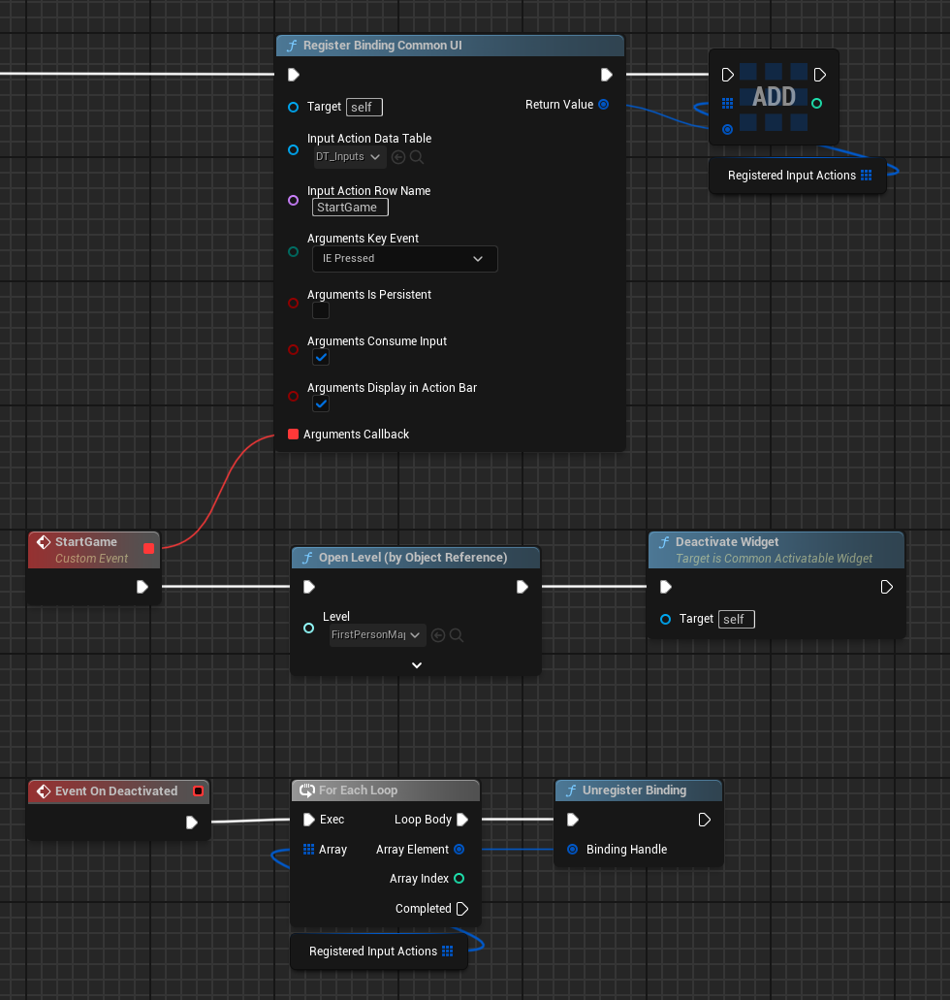
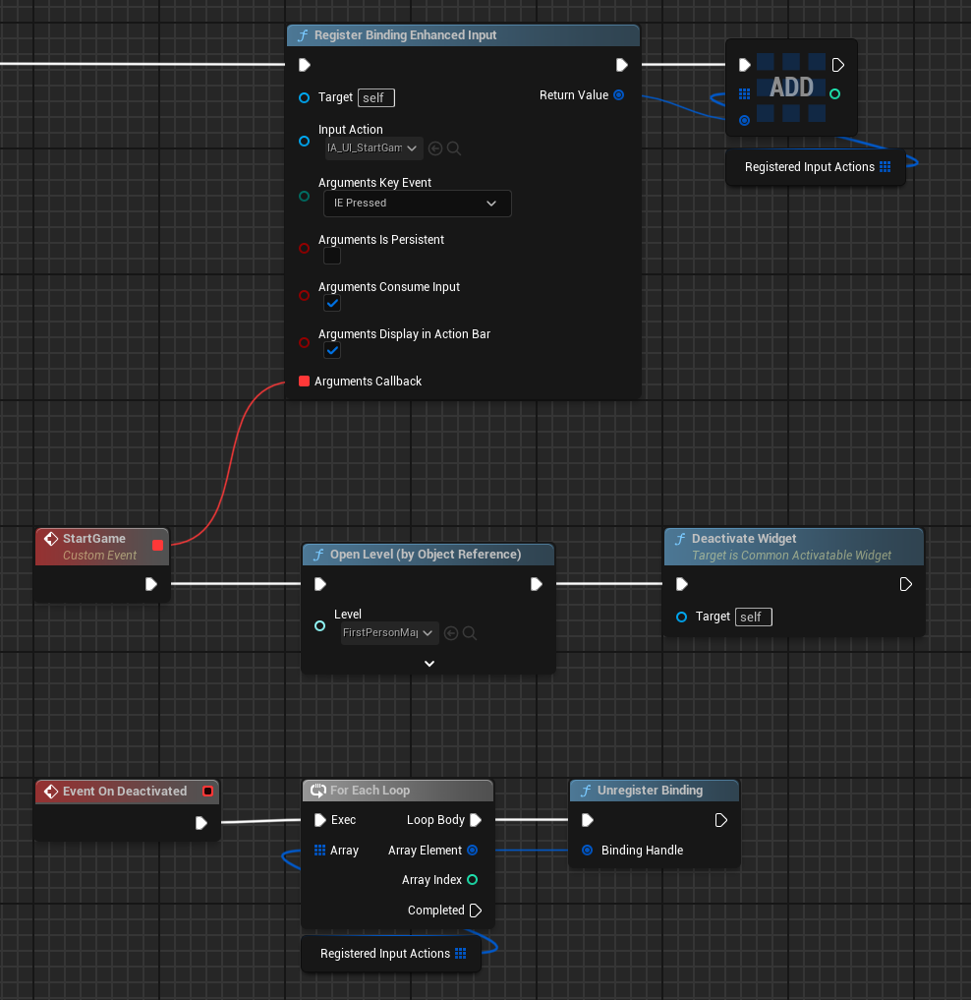
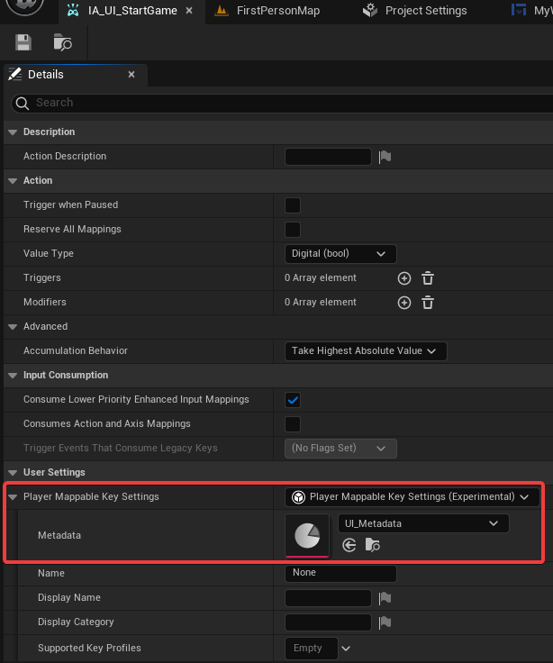
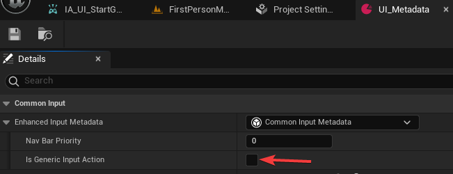
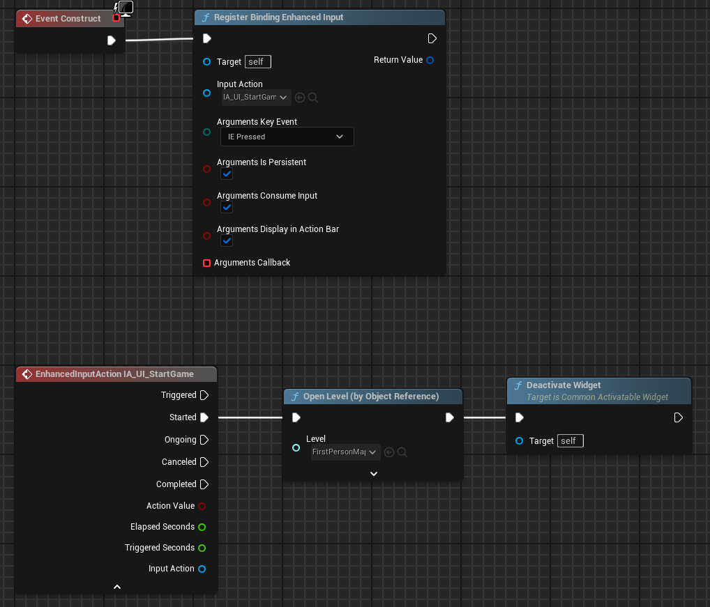

# Common UI Input Extensions

This plugin exposes some common UI input related functions to blueprints allowing to easily bind either common UI 
input actions or Enhanced Input Input Actions to common user widgets.

## Installation

Download the release that you wish to use from the
[Release](https://github.com/Tonetfal/CommonUIInputExtension/releases) page, and copy its Plugins directory
into your project's root.

## Usage

If you want to bind and manage your UI inputs using common UI efficiently, you can do the following:

Enhanced Input counterpart:

If you want to have the original input action event, you need to mark it as not generic.

Generic actions will fire only one delegate at a time, whereas non-generic actions fire any amount of IA events you 
have active and reachable.

 

 

## Generic notes

- To allow common UI action router to work, set GameViewportClientClass to CommonGameViewportClient.
- When using non-persistant input actions, ensure that there is a parent activatable widget relatively to the input
  binding target at any level. Also ensure that the widget is active; if it isn't the inputs are ignored by it.
- Don't forget to unregister bindings when the widget is not used anymore; this is specifically important to persistent
  inputs.

## Notes for Enhanced Input version

- [Common UI and Enhanced Input documentation](https://dev.epicgames.com/documentation/en-us/unreal-engine/using-commonui-with-enhnaced-input-in-unreal-engine)
- Make sure to bind IMC containing your input actions to get them firing. You can either do it manually or through 
  common activatable widget's details panel; ensure that you have enhanced input support enabled to see the property.
- Don't specify same IMC for both UI and game as the activatable widget will unregister it once deactivated.